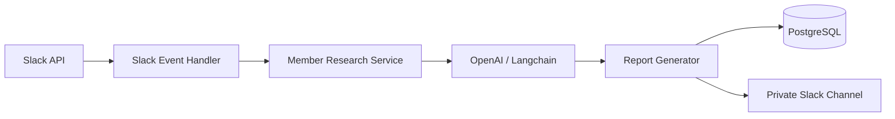

# 🤖 Slack AI Agent – Automate Member Analysis with GPT

> **Turn every new Slack member into a qualified lead**  
> Automatically research, score, and analyze new members using AI, then share insights with your team in a private channel.

---

## 🧠 Why This Bot Exists

Imagine this: someone joins your Slack community.  
You want to know:  
- Are they a potential customer?  
- What do they do?  
- How can we engage them?  

This bot does that for you — **on autopilot**.  
It watches for new members, researches their background (GitHub, company, title), and uses **OpenAI GPT-4** to give you a **fit score** and actionable recommendations, all saved to a **PostgreSQL database** before being posted to your private Slack channel.

---

## ✨ Features

- **👀 Automatic Monitoring** – Listens for `team_join` and `member_joined_channel` events in Slack.
- **🔎 AI Research** – Combines public data (company website, GitHub, email domain) with context from your product.
- **📊 Fit Scoring** – Each member gets a score out of 100, plus key insights and tailored outreach tips.
- **💾 Database-First** – Every analysis is stored in a **PostgreSQL** database (on Render) before sending to Slack – perfect for analytics and auditing.
- **📨 Private Reports** – Sends a beautifully formatted message to a designated private Slack channel.
- **⚡️ Ready-to-Deploy** – Includes a `render.yaml` for one‑click deployment on Render.com.
- **🛠 Test Endpoint** – In development, you can simulate a member analysis via `/test/analyze-member`.

---

## 🏗 Architecture at a Glance



---

## 📦 Prerequisites

- Node.js 18+  
- An [OpenAI API key](https://platform.openai.com/api-keys)  
- A Slack workspace where you can create apps  
- A [Render.com](https://render.com) account (for the PostgreSQL database and hosting)

---

## 🚀 Quick Start

### 1. Clone & Install

```bash
git clone https://github.com/Xawad11/Slack-AI-Bot.git
cd Slack-AI-Bot
npm install
```

### 2. Create Your Slack App

Go to [api.slack.com/apps](https://api.slack.com/apps) and create a new app.

- **OAuth & Permissions** – Add these scopes:  
  `channels:read`, `chat:write`, `users:read`, `users:read.email`  
  Install the app and copy the **Bot User OAuth Token** (`xoxb-...`).
- **Socket Mode** – Enable it and create an **App-Level Token** with scope `connections:write`. Copy that token (`xapp-...`).
- **Event Subscriptions** – Enable events and subscribe to:  
  `team_join` and `member_joined_channel`.
- **Basic Information** – Copy the **Signing Secret**.

### 3. Set Up PostgreSQL (Render)

1. On Render, click **New** → **PostgreSQL**.
2. Name it, choose free plan, and create.
3. Copy the **External Database URL** – that’s your `DATABASE_URL`.

### 4. Configure Environment

Copy the example:

```bash
cp .env.example .env
```

Fill in the variables (see the full table below).

### 5. Find Your Private Channel ID

Right‑click your private channel in Slack → **Copy link**.  
The ID is the part after `archives/`, e.g. `C1234567890`.

### 6. Run Locally

```bash
npm run dev
```

You should see:

```
🚀 Express server running on port 3000
⚡️ Slack bot connected
🎉 Slack AI Agent is running!
```

### 7. Test It

**Option A:** Add a real new member to your Slack workspace.  
**Option B:** Use the test endpoint (if `NODE_ENV=development`):

```bash
curl -X POST http://localhost:3000/test/analyze-member \
  -H "Content-Type: application/json" \
  -d '{"memberInfo":{"name":"John Doe","email":"john@techcorp.com","title":"Senior Engineer"}}'
```

You’ll see a report in your private channel and a record in the database.

---

## ⚙️ Environment Variables

| Variable | Required | What it is |
|----------|----------|------------|
| `SLACK_BOT_TOKEN` | ✅ | `xoxb-...` from Slack OAuth |
| `SLACK_APP_TOKEN` | ✅ | `xapp-...` from Socket Mode |
| `SLACK_SIGNING_SECRET` | ✅ | Slack signing secret |
| `SLACK_PRIVATE_CHANNEL_ID` | ✅ | Channel ID for reports |
| `OPENAI_API_KEY` | ✅ | Your OpenAI key |
| `DATABASE_URL` | ✅ | Render PostgreSQL external URL |
| `COMPANY_NAME` | ❌ | Used in AI prompts (e.g., "Xawad's Codebase") |
| `COMPANY_PRODUCT` | ❌ | e.g., "Personal Project" |
| `NODE_ENV` | ❌ | `development` enables test endpoint |
| `PORT` | ❌ | Default 3000 |

---

## 🌐 Deploying to Render

1. Push your code to GitHub.
2. On Render, create a **Web Service** → connect your repo.
3. Render will detect the `render.yaml` and auto‑configure.
4. Add **all environment variables** (above) in the Render dashboard.
5. Deploy – done! 🚀

---

## 📈 What a Report Looks Like

```
🔍 New Member Analysis: John Doe

Fit Score: 75/100
Email: john@techcorp.com
Title: Senior Software Engineer
Timezone: America/New_York

Key Insights:
• Senior engineer with 5+ years experience
• Works at a mid-size tech company
• Active on GitHub with multiple projects
• Located in target market region

Recommendations:
• Engage with technical content and demos
• Highlight enterprise features and scalability
• Consider direct outreach for pilot program

Research Sources:
• Company Website: TechCorp Inc.
• GitHub Profile: john-doe
```

---

## 🧩 Project Structure

```
.
├── index.js          # Main agent class
├── db.js             # PostgreSQL helpers
├── .env.example      # Template for secrets
├── render.yaml       # Infrastructure as code
└── package.json
```

---

## 🤝 Contributing

We ❤️ contributions!  

1. Fork the repo  
2. Create a branch: `git checkout -b feature/amazing-feature`  
3. Commit: `git commit -m 'Add amazing feature'`  
4. Push: `git push origin feature/amazing-feature`  
5. Open a PR

---

## 📄 License

MIT – see [LICENSE](LICENSE) for details.

---

## 🙌 Final Words

This bot is built for **community‑led growth**.  
Use it to identify your best leads, start meaningful conversations, and grow your product organically.

**Now go build your community!** 🎉
